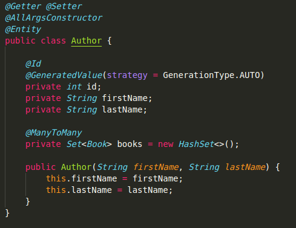
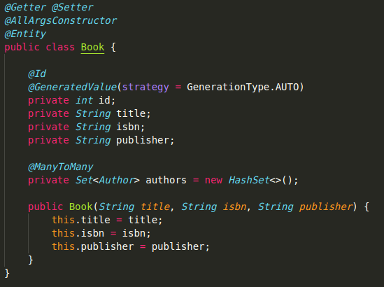
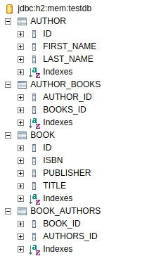

# Spring web app
This is a spring application that i've done to study spring-boot

# Dependencies
You'll need to have the [lombok](https://projectlombok.org/) to test this application

# Acessing the database
You'll need to access the database in the `http://localhost:8080/h2-console`

Be sure that the JDBC URL is `jdbc:h2:mem:testdb`

# @ManyToMany annotation
Here are ou classes
`Author`

`Book`

Our First try using only @ManyToMany annotation give us this tables

Now using the annotation in the 2 models, we got this schema
[img-4](assets/db-2.png)
